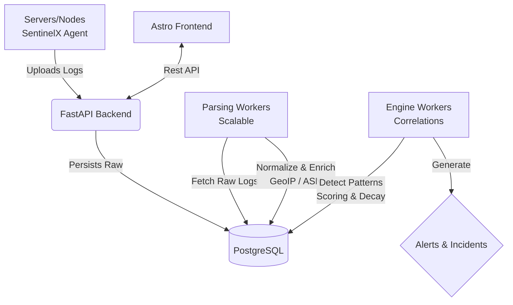

<h1 align="center">
  
  <br>
  SentinelX
</h1>

<p align="center">
  <b>A Lightweight, Scalable, and Dockerized SIEM (Security Information and Event Management) built for modern infrastructure.</b>
</p>

<p align="center">
  
  
  
  
  
</p>

<p align="center">
  <a href="#features">Features</a> •
  <a href="#architecture">Architecture</a> •
  <a href="#quick-start-zero-touch-installation">Quick Start</a> •
  <a href="#screenshots">Screenshots</a> •
  <a href="README_es.md">🇪🇸 Leer en Español</a>
</p>

---

## 🛡️ Overview

**SentinelX** is a high-performance SIEM platform designed to ingest, parse, normalize, and correlate security logs across your infrastructure. Powered by highly scalable asynchronous workers, it enriches events with GeoIP data and applies real-time anomaly detection rules, offering out-of-the-box alerting and decay mechanisms for entities.

Whether you run a single VPS or a distributed microservices environment, SentinelX gives you observability and security correlations with a **single command installation**.

## ✨ Features

- **🚀 Automated Zero-Touch Deployment**: SentinelX handles its own passwords, `.env` file generation, network mapping, and Nginx proxying via an interactive installer.
- **⚡ Asynchronous Processing**: Architected with decoupled `parsing_workers` and `engine_workers` bridging directly to PostgreSQL. Scales horizontally via Docker.
- **🌍 GeoIP & Entity Enrichment**: Automatically maps IPs to ASNs, countries, and domains for contextual anomalies.
- **📜 Multi-Service Log Normalization**: Native parsers for `Apache`, `Nginx`, `Exim`, `Dovecot`, `SSH`, and `ModSecurity`.
- **🎯 Dynamic Rule Engine**: Time-decay scoring and behavior-based correlations.
- **🖥️ Blazing Fast UI**: Dashboard built with Astro and modern JavaScript for snappy analytics.

---

## 📸 Visual Tour & Screenshots

<p align="center">
  <i>Explore the SentinelX interface: Modern, responsive, and designed for deep security visibility.</i>
</p>

| **1. Executive Dashboard** | **2. Correlated Alerts** |
|:---:|:---:|
|  |  |
| *Real-time activity charts and security KPIs at a glance.* | *Centralized view of detected threats and correlations.* |

| **3. Deep Forensic Detail** | **4. Incident Management** |
|:---:|:---:|
|  |  |
| *Extensive evidence collection including raw logs and metrics.* | *Full lifecycle case management for active threats.* |

| **5. Entity Intelligence** | **6. Engine Processes** |
|:---:|:---:|
|  |  |
| *Behavioral analysis and risk scoring for IPs and users.* | *Monitoring correlation engine health and ingest pipelines.* |

---

## 🏗️ Architecture

SentinelX fundamentally relies on a decoupled Publisher/Consumer methodology, highly abstracted through scalable Docker deployment.



---

## ⚡ Quick Start (Zero-Touch Installation)

Deploying a complex SIEM has never been easier. We provide a tailored, interactive installation script that auto-generates secure passwords, configures Docker Networks, handles Reverse Proxies, and builds the frontend.

**Prerequisites**:
- Linux (Ubuntu/Debian/RHEL/Alma) recommended.
- `Docker` and `Docker Compose (v2)`.

### 1-Command Install

```bash
git clone https://github.com/yourusername/SentinelX-Neubox.git
cd SentinelX-Neubox

# Launch the orchestrator
bash setup_sentinelx.sh
```

**What the script does for you:**
1. Prompts you for a `Local` (Fast Install) or `Server` (Public Domain) environment.
2. Auto-generates cryptographically secure `POSTGRES_PASSWORD`, `SECRET_KEY`, and `INITIAL_ADMIN_PASSWORD`.
3. Handles `GeoLite2` database detection.
4. Spins up a temporary isolated Nginx container if running locally, or configures the Host's Nginx for Public Domains.
5. Scales the asynchronous workers out-of-the-box (`docker compose up --scale parsing_worker=2`).

### Access the Platform
Once the script finishes, check your terminal for the Auto-Generated Admin Credentials.
- **Local Mode:** `http://localhost:4321`
- **Server Mode:** `https://your-configured-domain.com`

---

## 📈 Scalability

SentinelX supports scaling its log-crunching power at any time using Docker Compose:

```bash
# Add more parsing workers for heavy log ingestion
docker compose up -d --scale parsing_worker=4 --scale engine_worker=2
```

---

## 🤝 Contributing

Contributions are always welcome! Whether it's a new log parser, enhanced threat-detection rules, or frontend UI updates:

1. Fork the Project
2. Create your Feature Branch (`git checkout -b feature/AmazingFeature`)
3. Commit your Changes (`git commit -m 'Add some AmazingFeature'`)
4. Push to the Branch (`git push origin feature/AmazingFeature`)
5. Open a Pull Request

---

## 🔒 Security

We take security seriously. 
- Please **never** commit `.env` files or hardcoded credentials. 
- Ensure SentinelX is running behind a secure SSL reverse proxy in production environments.
- Report vulnerabilities to the repository owner directly.

## 📄 License
This project is open-source. See the [LICENSE](LICENSE) file for more details.
