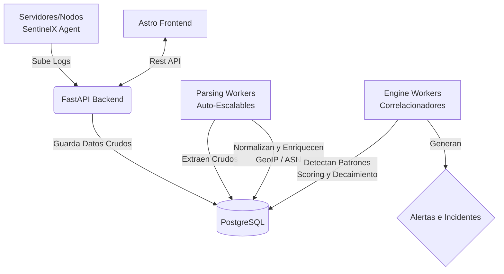

<h1 align="center">
  
  <br>
  SentinelX
</h1>

<p align="center">
  <b>Un SIEM (Security Information and Event Management) Ligero, Escalable y Contenerizado.</b>
</p>

<p align="center">
  
  
  
  
  
</p>

<p align="center">
  <a href="#características">Características</a> •
  <a href="#arquitectura">Arquitectura</a> •
  <a href="#quick-start-instalación-zero-touch">Quick Start</a> •
  <a href="#screenshots">Capturas</a> •
  <a href="README.md">🇬🇧 Read in English</a>
</p>

---

## 🛡️ Descripción

**SentinelX** es una plataforma SIEM de alto rendimiento diseñada para ingestar, parsear, normalizar y correlacionar logs de seguridad en toda tu infraestructura. Impulsada por *workers* asíncronos altamente escalables, enriquece los eventos mediante datos GeoIP y aplica reglas de detección de anomalías en tiempo real.

Ya sea que gestiones un VPS individual o un entorno distribuido de microservicios, SentinelX te otorga una visibilidad y correlación profunda con **una instalación de un solo comando**.

## ✨ Características

- **🚀 Despliegue Automatizado (Zero-Touch)**: SentinelX maneja de forma inteligente la generación de contraseñas, tu archivo `.env`, las redes de Docker y los proxys inversos (Nginx) usando un auto-instalador interactivo.
- **⚡ Procesamiento Asíncrono**: Arquitectura desacoplada con `parsing_workers` y `engine_workers` comunicándose con PostgreSQL. Escalable horizontalmente desde Docker.
- **🌍 Enriquecimiento de Entidades y GeoIP**: Mapeo automático de IPs a ASN, países y dominios para encontrar anomalías en milisegundos.
- **📜 Normalización Multi-Servicio**: Parsers nativos para `Apache`, `Nginx`, `Exim`, `Dovecot`, `SSH`, y `ModSecurity`.
- **🎯 Motor Dinámico de Reglas**: Evaluador de anomalías con sistemas de puntuación por comportamiento y decaimiento temporal.
- **🖥️ Interfaz Ultra Rápida**: Un Dashboard asombroso y ágil construido en Astro y JavaScript moderno.

---

## 📸 Capturas de Pantalla

*(Agrega tus capturas de pantalla del Dashboard aquí. Solo arrastra las imágenes en este archivo desde la edición en la web de GitHub)*

| Dashboard Principal | Alertas y Correlación |
|:---:|:---:|
|  |  |

---

## 🏗️ Arquitectura

SentinelX utiliza un diseño desacoplado Productor/Consumidor sumamente eficiente gracias a la contenerización nativa con Docker.



---

## ⚡ Quick Start (Instalación Zero-Touch)

Desplegar un SIEM complejo nunca había sido tan fácil. Proveemos un script de instalación "one-click" a medida que auto-genera contraseñas seguras, ajusta las variables de entorno, soluciona mitigaciones de Red (como las de CSF) y construye y sirve la interfaz frontend sin que tengas que tocar código.

**Requisitos Previos**:
- Linux (Ubuntu/Debian/RHEL/Alma) recomendado.
- `Docker` y `Docker Compose (v2)`.

### Instalación en 1 Comando

```bash
git clone https://github.com/yourusername/SentinelX-Neubox.git
cd SentinelX-Neubox

# Arrancar el orquestador
bash setup_sentinelx.sh
```

**¿Qué hace el script por ti?**
1. Te preguntará si estás en un ambiente `Local` (Install Rápida) o un entorno `Servidor` (Dominio Público).
2. Auto-generará contraseñas criptográficamente seguras para tu `POSTGRES_PASSWORD`, `SECRET_KEY`, y tu `INITIAL_ADMIN_PASSWORD`.
3. Validará la base de datos `GeoLite2` o se la saltará en modo rápido.
4. Levantará contenedores Nginx aislados localmente, o autoconfigurará tu Nginx global para tu dominio.
5. Escalará tus asynchronus-workers mágicamente (`docker compose up --scale parsing_worker=2`).

### Acceso a la Plataforma
En cuanto el script termine, imprime tus crendenciales Auto-Generadas en la terminal. ¡Cópialas!
- **Modo Local:** `http://localhost:4321`
- **Modo Servidor:** `https://tu-dominio-configurado.com`

---

## 📈 Escalamiento de Workers

SentinelX permite aumentar su poder de procesamiento sobre la marcha modificando la capa en Docker Compose:

```bash
# Agregar más parsing workers para ingestas masivas de logs
docker compose up -d --scale parsing_worker=4 --scale engine_worker=2
```

---

## 🤝 Contribuciones

¡Cualquier mejora es bienvenida! 

1. Haz un Fork del Proyecto
2. Crea tu rama de mejora (`git checkout -b feature/NuevaReglaDeDeteccion`)
3. Haz un Commit de tus cambios (`git commit -m 'Agrega reglas para SSH escalabilidad'`)
4. Haz Push a tu rama (`git push origin feature/NuevaReglaDeDeteccion`)
5. Abre un Pull Request

---

## 📄 Licencia
Este proyecto es código abierto. Revisa el archivo [LICENSE](LICENSE) para más detalles.
